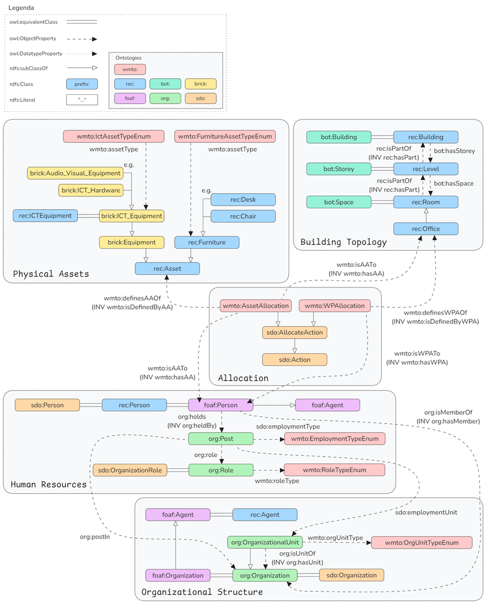

# Workplace Management Ontology for the University of Torino (WMTO)

## Overview

The Workplace Management of the University of Torino Ontology (WMTO) is a modular OWL ontology designed to support Workplace Management activities in enterprise environments. It provides semantic definitions for managing organizational structure, employee allocation, physical assets, and spatial topology within built environments.

WMTO addresses the need for semantic integration across three key workplace management domains:
- **Human Resources (HR)**: Employee details, organizational structure, and job postings
- **Facility Management (FM)**: Building topology, spatial allocation, and furniture assets
- **Information and Communication Technology (ICT)**: IT Equipment tracking and allocation

WMTO is designed to support:
- Digital Twins for workplace management
- Integration of heterogeneous workplace management data sources
- Space optimization and allocation planning
- Asset tracking and lifecycle management
- Remote work policy planning and insights
- Organizational structure visualization

This ontology is designed to balance interoperability through ontology reuse with scenario-specific needs through custom implementations. It adopts a modular architecture where each module captures a key domain notion with its attributes. 

## Aligned Ontologies

WMTO reuses and aligns concepts from established ontologies:

| Ontology | Prefix | Purpose |
|----------|--------|---------|
| [Building Topology Ontology (BOT)](https://w3id.org/bot#) | `bot:` | Topological structure and relationships in buildings |
| [Real Estate Core Ontology (REC)](https://w3id.org/rec#) | `rec:` | Real estate management and furniture concepts |
| [Brick](https://brickschema.org/schema/Brick#) | `brick:` | ICT equipment and technological assets |
| [The Organization Ontology (ORG)](https://www.w3.org/ns/org#) | `org:` | Organizational structure and employee membership |
| [Schema.org (SDO)](https://schema.org/) | `sdo:` | Event taxonomy and common entity properties |
| [Friend-of-a-Friend (FOAF)](http://xmlns.com/foaf/0.1/) | `foaf:` | Personal details and biographical information |

## Key Features

### HR Domain
- Organizational unit taxonomy and hierarchical structure
- Employee biographical details and identification
- Job posting and role differentiation
- Employment type classification
- Remote work tracking capabilities

### FM Domain
- Spatial topology representation (buildings, levels, rooms)
- Workplace allocation with temporal constraints
- Furniture asset management and location tracking
- Case-study-specific naming conventions

### ICT Domain
- Equipment type classification
- Asset identification and attributes (serial numbers, model numbers)
- Historical allocation tracking
- Commission and turnover date management

### Asset Allocation Pattern

WMTO implements an allocation pattern that:
- Maintains historical records without overwriting properties
- Links assets to persons or spaces through intermediate allocation nodes
- Carries temporal attributes (allocation date, deallocation date)
- Supports multiple allocation records over time

## Naming Conventions

Consistent naming conventions ensure clarity and usability:
- **Classes**: Singular, capitalized, Pascal Case for compound words (e.g., `WorkplaceAllocation`)
- **Properties**: Lower case Camel Case (e.g., `allocationDate`)
- **Individuals**: Capitalized words

## Technical Implementation

- **Editor**: Protégé
- **Format**: Turtle (TTL) syntax for machine-readable output
- **Axioms**: Includes class hierarchies, equivalence, disjointness, property constraints
- **Properties**: Both object properties and datatype properties with defined domains and ranges
- **Inverse Properties**: Implemented where applicable

The ontology implementation process:
1. Manual selection and import of classes, properties, and individuals
2. Verification of concept pertinence
3. Alignment through `owl:equivalentClass` axioms
4. Introduction of case-study-specific implementations
5. Documentation with labels and comments
6. Iterative refinement

## Future Extensions

The modular design allows for:
- Higher granularity adaptations
- Easy module replacement for changing requirements
- Integration with IoT sensing capabilities
- Expansion of remote working practice support
- Desk sharing scenario modeling

---

## License

GNU Affero General Public License v3 (GNU AGPL v3)

## Access

An extended version of the ontology is publicly available at <https://labosca.github.io/wmto-ontology/>.

## Contact

For questions, issues, or contributions, please open an issue on this repository.
